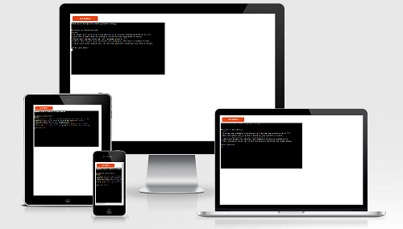
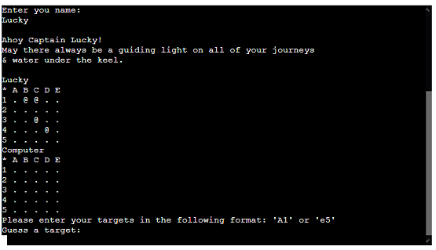
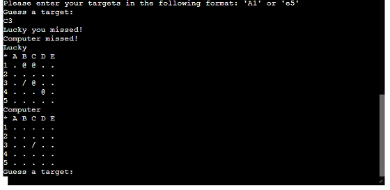
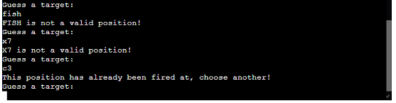
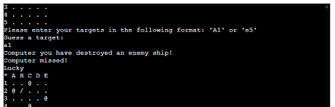
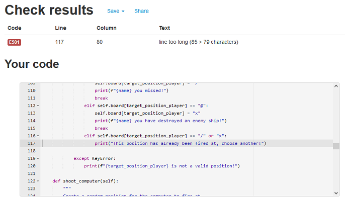

# BATTLESHIPS

Battleships is a python terminal game. It runs in the Code Institute mock terminal on Heroku.

The user can try to defeat the computer by locating all his battleships before the computer finds his.

The live link ca be found here - [BATTLESHIPS](https://portfolio-project-3-luca-noah.herokuapp.com/)

## How to play
---
Battleships is based on a classic pen-and-paper game that some of you may remember from your childhood.

In my version, the player enters his name and 2 boards with randomly placed ships are created.

The ships are displayed with an '@' on a 5x5 board.

The player sees only his own ships, not those of the computer.

On the edges of the board are the numbers 1-5 and the letters A-E, this allows to designate each field.

Guesses are marked with a '/', hits with an 'x'.

The player is first to guess, then the computer.

The player who destroys all enemy battleships first wins.

## Features
---
### Existing Features

- __Random board generation__

Ships are randomly distributed on the board of the player and the computer.

The player sees only the position of his own ships.

- __Play against the computer__

- __Accepts user input__

- __Input validation and error-checking__

The coordinates must exactly match a coordinate present on the board.

You can not enter the same guess twice.

- __Data maintained in class instances__

### Future Features

- __Allow player to select the board size and number of ships__
- __Allow player to position ships themselves__
- __Have ships larger than 1x1__

## Data Model
---
I have decided to use a board class as a data model. The game creates 2 instances of the board class, for user and computer. 

The board class stores the game board, positions of the ships, positions of the hits, positions of the guesses and the player name.

The class also has methods that the game needs to work. These are the print_board method, the place_ships method, the shoot_user and shoot_computer method and the all_ships_destroyed method to determine a winner.

## Testing
---
I have tested this project manually as follows:
- Passed the code through a PEP8 linter and confirmed there are no significant problems
- Given invalid inputs: unexpected input, out of bounds inputs, same input twice
- Tested in my local terminal and the Code Institute Heroku terminal
### Bugs
__Solved Bugs__
- When I changed the name of the variable used in the hit message, I had a display bug. There were 2 times computer instead of the name of the user. I fixed this by correcting the name of the variable.

__Remaining Bugs__
- No bugs remaining

### Validator Testing
- PEP8

1 Error message (Code:501)

This error message appears because the PEP8 linter considers the print statement on line 117 to be too long. This does not cause any problems in this project and can therefore not be considered critical.

## Deployment
---
This project was deployed using Code Institute's mock terminal for Heroku.

### Steps for deployment:
- Fork or clone this repository
- Create a new Heroku app
- Set the buildpacks to 'Python' and 'NodeJS' in that order
- Link the Heroku app to the repository
- Click on 'Deploy'

## Credits
---
- Code Institute for the deployment terminal